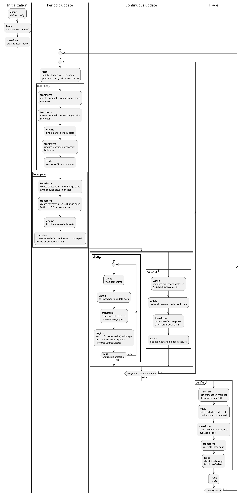

# Arbitrage Inspector

Arbitrage inspector is a trading/analysis bot which identifies triangular and multi-exchange arbitrage in cryptocurrency exchanges. It automatically accounts for network and exchange fees, as well as liquidity constants (aka slippage risk). It is using the CCXT library to interact with exchange API's.

## Objective

The primary objective of this project is to identify and exploit real arbitrage opportunities within live financial environments. By combining market theory with sophisticated algorithmic analysis, the project pushes the boundaries of automated trading to implement a viable solution. The cryptocurrency ecosystem was selected for its transparency and accessibility compared to traditional finance, however the same algorithms can be implemented in traditional financial markets.

## Achievements

Arbitrage inspector is able to fetch the most up-to-date price and fee information and find triangular arbitrage opportunities across multiple exchanges while accounting for all exchange and network fees.

## Usage

Currently, the arbitrage inspector can only fetch data, identify real arbitrage opportunities, and provide the arbitrage cycle. To run it you should switch to tag `v0.6` (without WS watcher) or to tag `v0.7` (with WS watcher). Then simply run `go run ./cmd/arbi/*`.

Note that the `v0.6` version may not be showing all found arbitrages because it has a >0.1% return threshold. Additionally, note that the `v0.7` version doesn't fully work. To configure arbi modify the `./cmd/arbi/main.go` directly.

## Control flow

The project was implemented based on a conceptual control flow shown in the following diagram:



The control flow aims to minimize the required time from data retrieval to trade execution. I believe it scales well with the project structure and performance.

## Project structure

The project is following separation of concerns based on functionality. The following is the project layout:

```c
arbitrage-inspector
├── cmd // clients
│   ├── arbi // main CLI client
│   └── tester // small testing client
├── docs // extra documentation
├── go.mod
├── go.sum
├── internal // packages
│   ├── engine // main algorithms
│   ├── fetch // RESP API data retrieval
│   ├── models // data structures
│   ├── trade // trade execution
│   ├── transform // data transformation
│   └── watch // WS API data watching
├── makefile
├── readme.md
├── todo.md
└── *.json // data cache
```

## Documentation

Further documentation can be found in the `./docs/` directory. It includes information about internal packages, process execution, and other technical details.
